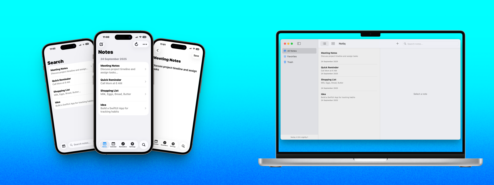

# NotiqApp

NotiqApp — An all-in-one productivity app for **macOS, iOS, iPadOS, and watchOS**.  
Take notes, manage your calendar, set reminders, and stay productive with a simple yet powerful app.  

  

---

## ✨ Features
- 📝 **Notes** — Quickly jot down ideas, class notes, or meeting summaries.  
- 📅 **Calendar & Reminders** — Plan your schedule and never miss an important date.  
- ⭐ **Favorites** — Mark important notes for instant access.  
- 🗑️ **Trash Bin** — Safely recover deleted notes when needed.  
- 📐 **Flexible Layouts** — Switch between **list** and **grid** views.  
- 🎨 **Customization** — Dark mode, layout preferences, and more.  
- 📡 **Cross-Platform** — Designed for Apple platforms: macOS, iOS, iPadOS, and watchOS.  

---

## 🚀 Roadmap
Planned features in upcoming releases:
- 🧠 **Mind Maps** — Organize your thoughts visually.  
- ✏️ **Sketch & Draw** — Annotate or create freehand drawings.  
- 🔄 **Sync** — iCloud integration for seamless syncing across devices.  
- 🤝 **Collaboration** — Share notes with classmates, friends, or colleagues.  

---

## 📥 Installation
Currently in **Nightly Preview** — available for testing on:  
- macOS (Universal build)  
- iOS & iPadOS (via TestFlight)  
- watchOS (companion app)  

> 📌 Public release will follow after stability testing.  

---

## 🧪 Nightly Builds
We publish nightly builds for early testers.  
Nightly versions are tagged with the format:  YYYY.MM.DD-nightly.X

Example: `2025.09.22-nightly.1`  

These builds may contain experimental features and bugs.  

---

## 📜 License
NotiqApp is licensed under the **GPL-3.0 license**.  
See [LICENSE](LICENSE) for details.  

---

## 💡 Contributing
We welcome contributions!  
- Open issues for bug reports or feature requests.  
- Submit pull requests with improvements or fixes.  

---

## 🌟 Acknowledgements
- Built with **SwiftUI** and **CoreData**.  
- Uses [WhatsNewKit](https://github.com/SvenTiigi/WhatsNewKit) and [OnboardingKit](https://github.com/your-onboardingkit-repo).  
- Inspired by productivity workflows for students and professionals.  

---

## 📷 Screenshots
*(Coming soon)*  

---

### 🔔 Stay tuned!
Follow development and get the latest updates on our GitHub releases page.  
